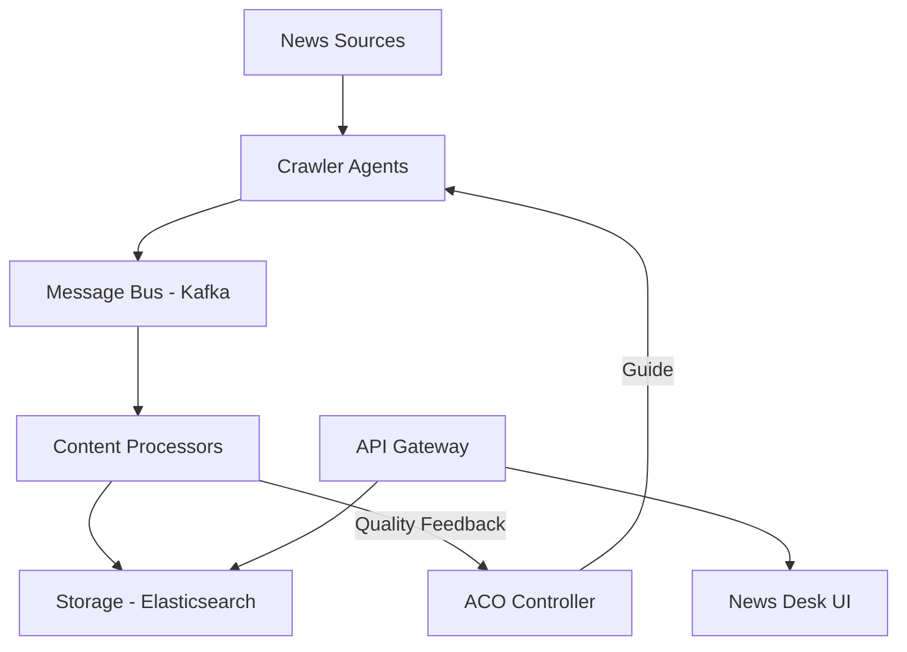

# News-ACO-System Documentation

## Overview

News-ACO-System is an intelligent news gathering system that uses Ant Colony Optimization (ACO) algorithms to efficiently collect, analyze, and organize news content. The system employs swarm intelligence principles to optimize news source selection and content processing.

## System Architecture

### Core Components



### Key Components:

1. **ACO System**
   - Manages swarm intelligence logic
   - Optimizes source selection
   - Updates pheromone trails
   - Balances exploration/exploitation

2. **Crawler Agents**
   - Collect news from various sources
   - Handle different source formats
   - Manage connection pools
   - Implement retry logic

3. **Content Processors**
   - NLP processing
   - Entity extraction
   - Topic modeling
   - Sentiment analysis

4. **Storage Layer**
   - Elasticsearch for content
   - Redis for caching
   - Kafka for messaging

## Installation

### Prerequisites
- Python 3.8+
- Docker and Docker Compose
- Git

### Setup Steps

1. **Clone the Repository**
```bash
git clone https://github.com/bdnhost/news-aco-system.git
cd news-aco-system
```

2. **Create Virtual Environment**
```bash
python -m venv venv
source venv/bin/activate  # On Windows: venv\Scripts\activate
```

3. **Install Dependencies**
```bash
pip install -r requirements.txt
```

4. **Start Services**
```bash
docker-compose up -d
```

5. **Initialize Database**
```bash
python src/utils/init_db.py
```

## Configuration

### Environment Variables
Create a `.env` file with the following variables:

```env
# API Settings
API_HOST=0.0.0.0
API_PORT=8000
DEBUG=True

# Elasticsearch
ELASTICSEARCH_URL=http://localhost:9200
ELASTICSEARCH_INDEX=news

# Kafka
KAFKA_BOOTSTRAP_SERVERS=localhost:9092
KAFKA_TOPIC=news_updates

# Redis
REDIS_URL=redis://localhost:6379
```

### Source Configuration
Define news sources in `config/sources.yaml`:

```yaml
sources:
  - name: Example News
    url: https://example.com/news
    selectors:
      article: div.article
      title: h1.title
      content: div.content
      date: time.published
    update_interval: 300
```

## Usage

### Starting the System

1. **Start the API Server**
```bash
uvicorn src.api.main:app --reload
```

2. **Run Crawler Agents**
```bash
python src/agents/run_crawlers.py
```

3. **Monitor System**
```bash
python src/utils/monitor.py
```

### API Endpoints

#### Status and Health
```http
GET /status
```
Returns system status and health metrics.

#### News Sources
```http
GET /sources
POST /sources
```
Manage news sources.

#### Articles
```http
GET /articles
GET /articles/{id}
```
Retrieve processed articles.

## Development

### Running Tests
```bash
# Run all tests
pytest

# Run specific test file
pytest tests/test_aco_system.py

# Run with coverage
pytest --cov=src
```

### Code Style
The project follows PEP 8 guidelines. Format code using:
```bash
black src/
isort src/
flake8 src/
```

### Adding New Features

1. **New Crawler Agent**
```python
from src.agents.base_agent import BaseAgent

class CustomCrawler(BaseAgent):
    async def process(self, data):
        # Implementation
        pass
```

2. **New Content Processor**
```python
from src.core.content_processor import ContentProcessor

class CustomProcessor(ContentProcessor):
    async def custom_analysis(self, content):
        # Implementation
        pass
```

## Contributing

1. Fork the repository
2. Create a feature branch
3. Commit changes
4. Create pull request

### Guidelines
- Write tests for new features
- Update documentation
- Follow code style guidelines
- Add type hints
- Include docstrings

## Troubleshooting

### Common Issues

1. **Elasticsearch Connection**
```python
# Check Elasticsearch status
curl localhost:9200/_cluster/health
```

2. **Kafka Topics**
```bash
# List topics
kafka-topics.sh --list --bootstrap-server localhost:9092
```

3. **Redis Cache**
```bash
# Monitor Redis
redis-cli monitor
```

## System Metrics

### Performance Monitoring
- Request rate
- Processing latency
- Cache hit ratio
- Agent efficiency

### Quality Metrics
- Content relevance
- Source reliability
- Processing accuracy
- Coverage completeness

## Roadmap

### Version 1.0
- [x] Basic crawling system
- [x] ACO implementation
- [x] Content processing
- [ ] API endpoints
- [ ] Dashboard UI

### Future Plans
- Enhanced NLP processing
- Multi-language support
- Real-time analytics
- Machine learning integration

## License
MIT License - See LICENSE file for details
