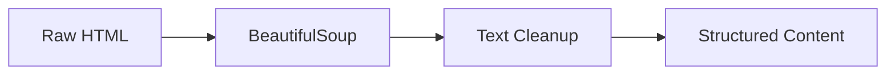
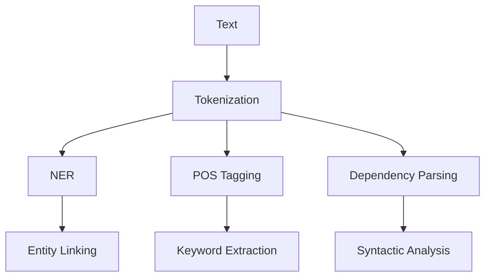

# News-ACO-System 
# Technical Documentation

## ACO Algorithm Implementation

### Pheromone Update Formula

The system uses the following formula for pheromone updates:

```
τᵢⱼ(t+1) = (1-ρ)τᵢⱼ(t) + Δτᵢⱼ

where:
- τᵢⱼ is the pheromone level
- ρ is the evaporation rate
- Δτᵢⱼ is the quality score
```

### Source Selection

Source selection uses a probability formula:

```python
P(s) = (τₛ^α * η_s^β) / Σ(τᵢ^α * ηᵢ^β)

where:
- τₛ is the pheromone level for source s
- ηₛ is the heuristic value
- α and β are weight parameters
```

## Content Processing Pipeline

### 1. Text Extraction


### 2. NLP Processing


### 3. Quality Assessment

Quality score calculation:

```python
def calculate_quality(article):
    weights = {
        'relevance': 0.3,
        'freshness': 0.2,
        'reliability': 0.2,
        'completeness': 0.15,
        'uniqueness': 0.15
    }
    
    scores = {
        'relevance': assess_relevance(article),
        'freshness': assess_freshness(article),
        'reliability': assess_reliability(article),
        'completeness': assess_completeness(article),
        'uniqueness': assess_uniqueness(article)
    }
    
    return sum(w * scores[k] for k, w in weights.items())
```

## Data Models

### Article Schema
```json
{
  "id": "string",
  "title": "string",
  "content": "string",
  "source": {
    "name": "string",
    "url": "string",
    "reliability": "float"
  },
  "metadata": {
    "published_date": "datetime",
    "authors": ["string"],
    "categories": ["string"]
  },
  "analysis": {
    "entities": ["string"],
    "keywords": ["string"],
    "sentiment": "float",
    "summary": "string"
  },
  "quality_metrics": {
    "relevance_score": "float",
    "freshness_score": "float",
    "reliability_score": "float"
  }
}
```

## Performance Optimizations

### Caching Strategy
1. **Content Cache**
   ```python
   CACHE_TTL = {
       'article': 3600,  # 1 hour
       'source': 86400,  # 24 hours
       'analysis': 7200  # 2 hours
   }
   ```

2. **Batch Processing**
   ```python
   BATCH_SIZES = {
       'crawling': 10,
       'processing': 50,
       'indexing': 100
   }
   ```

### Resource Management
1. **Connection Pools**
   ```python
   POOL_SIZES = {
       'http': 100,
       'database': 20,
       'redis': 10
   }
   ```

2. **Rate Limiting**
   ```python
   RATE_LIMITS = {
       'per_source': 60,  # requests per minute
       'per_ip': 1000,    # requests per hour
       'global': 10000    # requests per hour
   }
   ```

## Error Handling

### Retry Mechanisms
```python
RETRY_CONFIG = {
    'max_retries': 3,
    'backoff_factor': 2,
    'status_forcelist': [500, 502, 503, 504]
}
```

### Circuit Breaker
```python
CIRCUIT_BREAKER = {
    'failure_threshold': 5,
    'reset_timeout': 60,
    'call_timeout': 10
}
```

## Monitoring

### Metrics Collection
1. **System Metrics**
   - CPU usage
   - Memory consumption
   - Network I/O
   - Disk usage

2. **Application Metrics**
   - Request latency
   - Error rates
   - Cache hit ratios
   - Queue lengths

3. **Business Metrics**
   - Articles processed
   - Source coverage
   - Content quality
   - User engagement

### Alerting Rules
```yaml
alerts:
  high_error_rate:
    threshold: 5%
    window: 5m
    
  high_latency:
    threshold: 2s
    percentile: 95
    window: 1m
    
  low_coverage:
    threshold: 80%
    window: 1h
```

## Security

### API Authentication
```python
AUTH_CONFIG = {
    'jwt_secret': 'env_var',
    'token_expiry': 3600,
    'refresh_token_expiry': 86400
}
```

### Rate Limiting
```python
RATE_LIMIT_CONFIG = {
    'default': '100/minute',
    'authenticated': '1000/minute',
    'crawler': '10000/minute'
}
```

### Input Validation
```python
VALIDATION_RULES = {
    'url': r'^https?://[\w\-\.]+\.\w+.*$',
    'email': r'^[\w\-\.]+@([\w-]+\.)+[\w-]{2,4}$',
    'api_key': r'^[a-zA-Z0-9]{32}$'
}
```